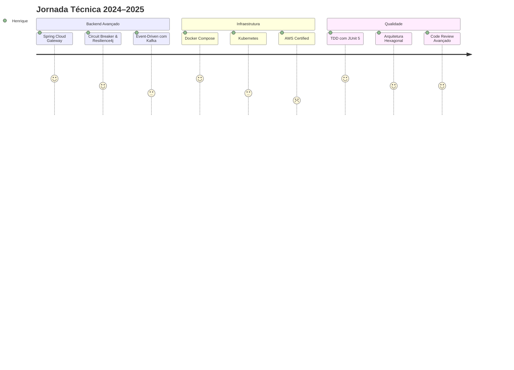
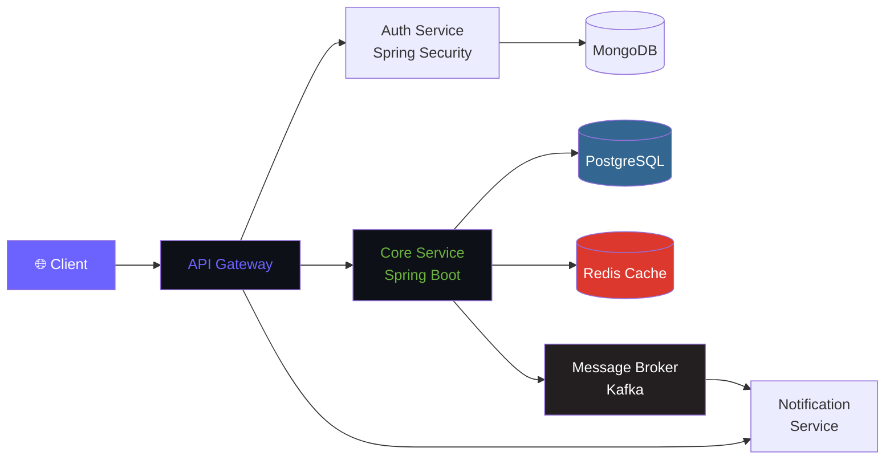

<div align="center">


</div>

<div align="center">

[](https://git.io/typing-svg)

<br/>

<a href="https://www.linkedin.com/in/henrique-pierandrei/">
  
</a>
<a href="mailto:profissional.pierandrei@gmail.com">
  
</a>
<a href="https://wa.me/5532999701559">
  
</a>
<a href="https://discord.com/channels/@rique-pieran/">
  
</a>

<br/><br/>


</div>

---

## `$ whoami`

```java
@Developer
public class HenriquePFernandes {

    private static final String NOME        = "Henrique P. Fernandes";
    private static final String LOCALIZAÇÃO = "Rodeiro, MG — Brasil 🇧🇷";
    private static final String CARGO       = "Full Stack Developer · Backend Specialist";
    private static final String EMAIL       = "profissional.pierandrei@gmail.com";

    private static final String[] FOCO_ATUAL = {
        "Arquitetura de Microsserviços com Spring Cloud",
        "APIs REST & GraphQL de alta performance",
        "Clean Architecture + Domain-Driven Design",
        "Containerização com Docker & Kubernetes"
    };

    private static final String MISSÃO =
        "Construir software robusto, escalável e elegante — " +
        "onde cada linha de código conta uma história de qualidade.";

    public static void main(String[] args) {
        System.out.println("Bem-vindo ao meu perfil! " + MISSÃO);
    }
}
```

> 💡 Backend-first developer com paixão por sistemas bem projetados, código sustentável e soluções que escalam.

---

## 🧭 Visão Geral

<table>
<tr>
<td width="50%">

### 🔥 Em foco agora
- 🏗️ Microsserviços com **Spring Cloud & Kubernetes**
- ⚡ Otimização de queries e **modelagem avançada de BD**
- 🔐 Segurança de APIs com **Spring Security & OAuth2**
- 📦 **CI/CD Pipelines** com GitHub Actions
- ☁️ Cloud com **AWS (EC2, S3, RDS)**

</td>
<td width="50%">

### 🎯 Diferenciais
- ✅ Código orientado a **testes e qualidade**
- ✅ Forte base em **princípios SOLID & Clean Code**
- ✅ Experiência em projetos **multi-tenant e de alta carga**
- ✅ Comunicação clara e **documentação técnica**
- ✅ Autonomia com **metodologias ágeis**

</td>
</tr>
</table>

---

## 🛠️ Stack Tecnológico

### Linguagens de Programação

<div align="center">


</div>

### Frameworks & Ecossistema Backend

<div align="center">


</div>

### Frontend & UI

<div align="center">


</div>

### Bancos de Dados

<div align="center">


</div>

### DevOps, Cloud & Ferramentas

<div align="center">


</div>

---

## 📊 Métricas do GitHub

<div align="center">


</div>

<div align="center">


</div>

<div align="center">

[](https://github.com/ryo-ma/github-profile-trophy)

</div>

---

## 🗺️ Roadmap de Aprendizado



---

## 🏗️ Arquitetura que Pratico



---

## 💼 O que Posso Entregar

<table>
<tr>
<td align="center" width="25%">

**🔌 APIs REST & GraphQL**

Design, versionamento, documentação com Swagger/OpenAPI e autenticação segura

</td>
<td align="center" width="25%">

**🏗️ Arquitetura de Sistemas**

Microsserviços, event-driven, DDD e Clean Architecture aplicados ao mundo real

</td>
<td align="center" width="25%">

**🗄️ Banco de Dados**

Modelagem relacional, queries otimizadas, migrations e estratégias de caching

</td>
<td align="center" width="25%">

**🐳 DevOps & Deploy**

Containerização, CI/CD pipelines, monitoramento e infraestrutura como código

</td>
</tr>
</table>

---

## 📐 Princípios que Guiam Meu Trabalho

```
  ╔══════════════════════════════════════════════════════════════╗
  ║                    CLEAN CODE MANIFESTO                      ║
  ╠══════════════════════════════════════════════════════════════╣
  ║  S — Single Responsibility   │  Cada classe, um propósito   ║
  ║  O — Open/Closed             │  Extensível, não modificável ║
  ║  L — Liskov Substitution     │  Subtipos sem surpresas      ║
  ║  I — Interface Segregation   │  Interfaces coesas           ║
  ║  D — Dependency Inversion    │  Dependa de abstrações       ║
  ╠══════════════════════════════════════════════════════════════╣
  ║  DRY  · Don't Repeat Yourself     │  Reutilize, não copie   ║
  ║  KISS · Keep It Simple            │  Simples é sustentável  ║
  ║  YAGNI · You Ain't Gonna Need It  │  Construa o necessário  ║
  ╚══════════════════════════════════════════════════════════════╝
```

> *"Qualquer tolo pode escrever código que um computador entende. Bons programadores escrevem código que humanos entendem."*
> — **Martin Fowler**

---

## 📫 Vamos Construir Algo Juntos?

<div align="center">

Aberto a **freelas**, **colaborações open source**, **oportunidades CLT/PJ** e **mentorias**.

<br/>

<a href="https://www.linkedin.com/in/henrique-pierandrei/">
  
</a>
&nbsp;
<a href="mailto:profissional.pierandrei@gmail.com">
  
</a>
&nbsp;
<a href="https://wa.me/5532999701559">
  
</a>

<br/><br/>

⏱️ **Tempo médio de resposta:** menos de 24h

</div>

---

<div align="center">


</div>

<div align="center">


**Desenvolvido com ☕, dedicação e muito `git commit` por Henrique P. Fernandes**

*"A melhor maneira de prever o futuro é construí-lo."*

</div>
