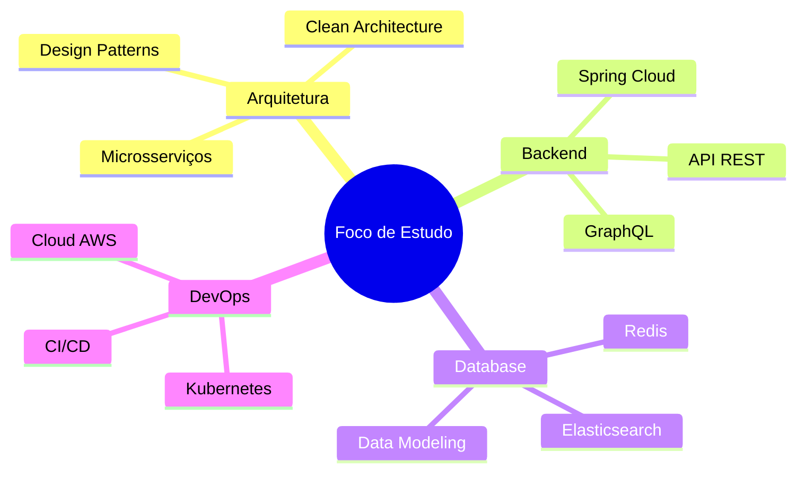

<div align="center">

# 👨‍💻 Henrique P. Fernandes

### Desenvolvedor Full Stack | Backend Specialist

[](https://git.io/typing-svg)

<br>

[](https://www.linkedin.com/in/henrique-pierandrei/)
[](https://discord.com/channels/@rique-pieran/)
[](https://wa.me/5532999701559)
[](mailto:profissional.pierandrei@gmail.com)

<br>

</div>

---

<br>

## 🎯 Sobre Mim


```java
public class DeveloperProfile {
    
    private final String nome = "Henrique P. Fernandes";
    private final String localizacao = "Rodeiro, MG 🇧🇷";
    private final String stack = "Full Stack Developer";
    private final String especialidade = "Backend Development";
    
    private final List<String> focoAtual = Arrays.asList(
        "Spring Boot & Spring Ecosystem",
        "Arquitetura de Microsserviços",
        "Clean Code & Design Patterns",
        "API REST & GraphQL"
    );
    
    private final Map<String, List<String>> habilidades = Map.of(
        "Backend", List.of("Java", "Spring Boot", "Python", "PL/SQL"),
        "Frontend", List.of("HTML5", "CSS3", "JavaScript", "Tailwind"),
        "Database", List.of("MySQL", "PostgreSQL", "MongoDB", "SQLite"),
        "Tools", List.of("Git", "Docker", "IntelliJ", "VS Code")
    );
    
    public String getMissao() {
        return "Construir soluções escaláveis e eficientes " +
               "que transformem problemas em código elegante";
    }
}
```

<br clear="right"/>

---

<br>

## 🛠️ Stack Tecnológico

### 💻 Linguagens

<div align="center">


</div>

### 🚀 Frameworks & Bibliotecas

<div align="center">


</div>

### 🗄️ Bancos de Dados

<div align="center">


</div>

### 🔧 Ferramentas & DevOps

<div align="center">


</div>

<br>

---

<br>

## 📊 GitHub Stats

<div align="center">
  
  
</div>

<div align="center">
  
</div>

<br>

---

<br>

## 🎓 Aprendizado Contínuo

<div align="center">



</div>

<br>

---

<br>

## 💡 Soft Skills

<div align="center">

| 🎯 Resolução de Problemas | 🤝 Trabalho em Equipe | 📚 Aprendizado Contínuo |
|:-------------------------:|:---------------------:|:-----------------------:|
| Pensamento analítico e lógico | Comunicação efetiva | Autodidata motivado |
| Debugging e troubleshooting | Colaboração ágil | Adaptabilidade rápida |

</div>

<br>

---

<br>

## 🌟 Filosofia de Desenvolvimento

<div align="center">

> *"Código limpo não é escrito seguindo regras. Você não se torna um artesão de software simplesmente aprendendo uma lista de heurísticas. Profissionalismo e artesania vêm de valores que direcionam as disciplinas."*
> 
> **— Robert C. Martin (Uncle Bob)**

<br>

### 🎯 Meus Princípios

🔹 **Clean Code** - Código legível é código sustentável  
🔹 **SOLID** - Fundamentos para arquitetura robusta  
🔹 **DRY** - Don't Repeat Yourself  
🔹 **KISS** - Keep It Simple, Stupid  
🔹 **Testing** - Code that works, code that lasts  

</div>

<br>

---

<br>

## 📫 Vamos Conversar?

<div align="center">

Estou sempre aberto a novos projetos, colaborações e oportunidades!

### 🤝 Como posso ajudar você?

💼 **Desenvolvimento de APIs REST/GraphQL**  
🏗️ **Arquitetura de Sistemas Escaláveis**  
🔧 **Backend com Spring Boot**  
📊 **Modelagem e Otimização de Banco de Dados**  
🐳 **Containerização e DevOps**

<br>

[](https://www.linkedin.com/in/henrique-pierandrei/)
[](mailto:profissional.pierandrei@gmail.com)
[](https://wa.me/5532999701559)

<br>

### ⭐ Se você gostou do meu trabalho, considere dar uma estrela nos repositórios!

<br>


</div>

<br>

---

<div align="center">

### 🚀 *"A melhor maneira de prever o futuro é inventá-lo"* 

**Desenvolvido com ❤️ e ☕ por Henrique P. Fernandes**


</div>
